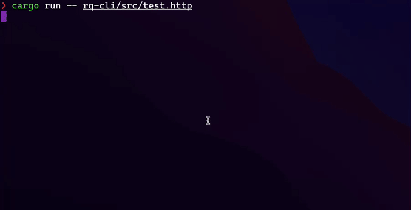

# rq
[](https://github.com/TheRealLorenz/rq/actions/workflows/rq-core.yml)



`rq` is an interactive HTTP client that parses and execute requests. It attempts to provide a minimal CLI 
alternative to [vscode-restclient](https://github.com/Huachao/vscode-restclient).
`rq` follows the standard [RFC 2616](https://www.w3.org/Protocols/rfc2616/rfc2616-sec5.html).

Original author blogpost: https://protiumx.github.io/blog/posts/an-http-request-parser-with-rust-and-pest-rs/

This project is based on [PEG](https://en.wikipedia.org/wiki/Parsing_expression_grammar).

## Dependencies

- [pest](https://github.com/pest-parser/pest): PEG parser 
- [reqwest](https://github.com/seanmonstar/reqwest): HTTP requests
- [tui-rs](https://github.com/fdehau/tui-rs/): TUI library
- [crossterm](https://github.com/crossterm-rs/crossterm): tui-rs backend
- [tokio](https://github.com/tokio-rs/tokio): asynchronous runtime

## Packages

### `rq-core`

Contains the core functionality: `pest` grammar and request execution.

### `rq-cli`

CLI application that uses `tui-rs` to render all the requests and a buffer to show responses.
This package is the default target for `cargo` workspaces.

Run `rq-cli` with `cargo`:
```sh
cargo run -- requests.http
```

## HTTP Request Grammar

The `pest` grammar can be found [here](./rq-core/src/grammar.pest).
You can use the [pest editor](https://pest.rs/#editor) to try it out and check how it works.

### Explanation

```
-- request --
{request_line}\r\n
{header \r\n \r\n}*
{body \r\n}*
```

A `request` is conformed by: `{ request_line, headers, body}`, where `headers` and `body` are optional
matches.
A `request_line` is conformed by: `{ method, target, version }`.
A `headers` is a collection of `header` `{ header_name, header_value }`
A `body` is anything that doesn't match headers and has a preceding line break, as specified in the RFC.
